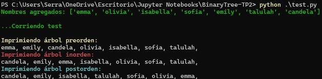

# Binary Tree

Un pequeño motor de arbol binario que proporciona una clase principal Arbol, que sirve como estructura principal para construir el Nodo raiz y realizar los recorridos. Puedes iniciar y testear esta clase con los archivos de la carpeta `/tests` o también puede ejecutar `main.py` para ingresar sus valores propios por teclado

Guía rápida:
`/engine` Incluye las clases y el archivo vacío `__init__.py` para definir la carpeta como paquete.
`arbol.py` Clase main constructora del arbol y las salidas.
`colors.py` Clase para modificar los colores de salida en consola.
`nodo.py` Clase para el nodo raíz.
`/examples` Contiene archivos de visualización `ipynb` para entender el funcionamiento del código.
`main.py` Archivo de ejecución para ingresar elementos por teclado.
`test.py` Archivo de ejecución con elementos previamente definidos.

### Instalación desde CMD o Powershell

```bash
git clone https://github.com/Santserrano/binarytree.git

```

### Instalación de dependencias
`Requirements.txt` instalará Jupyter Notebook para ejecutar los archivos `.ipynb` y Graphviz para graficar digrafos.

Al ejecutar los archivos `.ipynb` deberá seleccionar el kernel de python en caso de que use Visual Studio Code.
Caso contrario, si utiliza la distribución de `Conda` deberá tener configuradas las dependencias en `Anaconda Navigator`
Esta última dependencia no se encuentra en `requirements.txt` ya que no es necesaria si se ejecuta en Visual Studio Code.


```bash
pip install -r requirements.txt

```

### Ejemplo de uso - test

Ejecute algún test con valores previamente definidos desde CMD.
Navegue hasta el directorio del repositorio y ejecute el siguiente comando:
```bash
python .\test.py
```
Obtendrá la salida:



### Ejemplo de uso - valores por teclado

Ejecute el archivo `main.py` e ingrese la cantidad de elementos que desea agregar con sus respectivos nombres:
```python
python .\main.py
```

```python
Ingresa la cantidad de elementos: 3
Ingresa el elemento raiz: olivia
[Elemento 1]
Ingresa el nombre: sofia
[Elemento 2]
Ingresa el nombre: talulah
...

Imprimiendo árbol preorden:
olivia, sofia, talulah,
Imprimiendo árbol inorden:
olivia, sofia, talulah,
Imprimiendo árbol postorden:
talulah, sofia, olivia,
```
El código de `main.py` contiene la siguiente instrucción:
```python
from engine.arbol import Arbol
from engine.colors import colors

cantidad = input(colors.YELLOW + "Ingresa la cantidad de elementos: " + colors.RESET)

for i in range(int(cantidad)):
    if (i==0):
        nombre = input(colors.GREEN + "Ingresa el elemento raiz: " + colors.RESET)
        arbol = Arbol(nombre)
    else:
        print(colors.GREEN + f'[Elemento {i}]'+ colors.RESET)
        nombre = input(colors.RED + "Ingresa el nombre: " + colors.RESET)
        arbol.agregar(nombre)

print('...\n')
arbol.preorden()
arbol.inorden()
arbol.postorden()
```

### Jupyter Notebook / ipynb

Los archivos de Jupyter Notebook, tales como `trace_graph.ipynb` produce gráficos de visualización para construir los digrafos. Estos archivos presentan la extensión `.ipynb` que, a diferencia de python `.py` ofrece ejecución en bloques de código y renderizado gráfico (ej. tablas, trazos, grafos, gráficas de función, etc).

Puede utilizar la documentación didáctica para entender el funcionamiento del código :)
Incluyen los archivos:
`example.ipynb` `graph.ipynb`

Aquí un ejemplo del contenido de `graph.ipynb`, (Aún no fue definido pero esto ayudará a graficar el arbol):

```python
from graphviz import Digraph

def trace(root):
    nodes, edges = set(), set()
    def build(v):
        if v not in nodes:
            nodes.add(v)
            for child in v._prev:
                edges.add((child, v))
                build(child)
    build(root)
    return nodes, edges

def draw_dot(root, format='svg', rankdir='LR'):
    """
    format: png | svg | ...
    rankdir: TB (top to bottom graph) | LR (left to right)
    """
    assert rankdir in ['LR', 'TB']
    nodes, edges = trace(root)
    dot = Digraph(format=format, graph_attr={'rankdir': rankdir}) #, node_attr={'rankdir': 'TB'})
    
    for n in nodes:
        dot.node(name=str(id(n)), label = "{ data %.4f | grad %.4f }" % (n.data, n.grad), shape='record')
        if n._op:
            dot.node(name=str(id(n)) + n._op, label=n._op)
            dot.edge(str(id(n)) + n._op, str(id(n)))
    
    for n1, n2 in edges:
        dot.edge(str(id(n1)), str(id(n2)) + n2._op)
    
    return dot
```
### Configurar git 

Clone el repositorio como se menciona en el inicio de la documentación.
Luego, utilizando CMD o Windows Powershell posicionado en la carpeta del proyecto, realice los cambios pertinentes y haga uso de los siguientes comandos para generar el commit y que se vea reflejada la actualización.

En "Descripción breve de los cambios realizados" puede reemplazar con un comentario acerca de los cambios que realizó.

```bash
git add .
git commit -m "Descripción breve de los cambios realizados"
git push origin master
```

También puede utilizar el siguiente comando para verificar el estado de los cambios que aún no han sido guardados:
```bash
git status
```

Para actualizar el repositorio local con el repositorio actualizado en github, utilice el siguiente comando:
```bash
git pull
```
